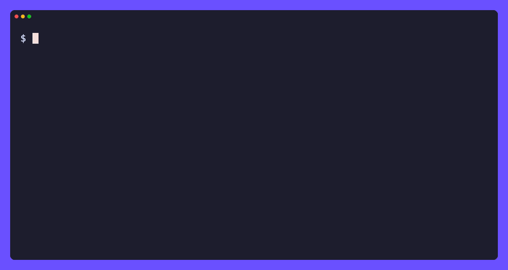

# ytb

[](https://github.com/tamnd/ytb-cli/actions/workflows/ci.yml)
[](https://github.com/tamnd/ytb-cli/releases/latest)
[](https://pkg.go.dev/github.com/tamnd/ytb-cli)
[](https://goreportcard.com/report/github.com/tamnd/ytb-cli)
[](./LICENSE)

A command line for [YouTube](https://www.youtube.com). `ytb` resolves any video,
channel, playlist, comment thread, transcript, or YouTube Music record into clean
structured data. One pure-Go binary, no API key, no quota.

[Install](#install) • [Commands](#commands) • [Usage](#usage) • [The local store](#the-local-store)



It talks to the same public InnerTube endpoints the YouTube site uses, so there
is no key to register and no quota to budget. Responses are cached on disk, so a
repeat call is instant. Pass `--db` and every record is also upserted into a
local SQLite store you can query with SQL.

`ytb` is an independent tool. It is not affiliated with YouTube or Google.

## Install

```bash
go install github.com/tamnd/ytb-cli/cmd/ytb@latest
```

Or grab a prebuilt binary, a Linux package (`deb`/`rpm`/`apk`), or a container
image from the [releases](https://github.com/tamnd/ytb-cli/releases):

```bash
brew install tamnd/tap/ytb
docker run --rm ghcr.io/tamnd/ytb:latest search 'lofi hip hop' -n 10
```

Shell completion is built in: `ytb completion bash|zsh|fish|powershell`.

`yt-dlp` is optional and only needed for `download`, `extract`, and as a
transcript fallback when YouTube gates the caption endpoints.

## Commands

| Command | Reads |
| --- | --- |
| `ytb video <id\|url>...` | one or more videos; full metadata |
| `ytb channel <handle\|url>` | channel metadata; `--videos`, `--shorts`, `--streams`, `--playlists` |
| `ytb playlist <id\|url>` | a playlist's header and items |
| `ytb search <query>` | search with type, duration, features, and sort filters |
| `ytb trending` | what is hot right now; `--category` |
| `ytb comments <id\|url>` | a video's comments and replies; `--sort` |
| `ytb community <handle\|url>` | a channel's community / posts tab |
| `ytb hashtag <tag>` | a hashtag feed |
| `ytb related <id\|url>` | related videos for a video |
| `ytb suggest <term>` | search autocomplete terms |
| `ytb transcript <id\|url>` | caption tracks and transcript text; `--timestamps`, `--lang` |
| `ytb formats <id\|url>` | streaming format metadata; `--audio`, `--video`, `--muxed` |
| `ytb music search <query>` | YouTube Music search |
| `ytb music artist <id\|url>` | a Music artist's profile and releases |
| `ytb music album <id\|url>` | a Music album |
| `ytb music playlist <id\|url>` | a Music playlist |
| `ytb music song <id\|url>` | a Music track |
| `ytb download <id\|url>` | download media via yt-dlp |
| `ytb extract <id\|url>` | extract a specific stream via yt-dlp; `--audio`, `--video` |
| `ytb seed <query\|url>...` | load a worklist into the crawl queue |
| `ytb crawl` | drain the crawl queue with workers |
| `ytb queue` | inspect the crawl queue |
| `ytb jobs` | recent crawl job history |
| `ytb export <handle\|id>` | render the store as interlinked Markdown |
| `ytb db stats\|query\|search\|vacuum` | work with the local SQLite store |
| `ytb config show\|init\|path` | show or reset configuration |
| `ytb cache path\|info\|clear` | inspect or clear the on-disk cache |
| `ytb serve` | serve all operations over HTTP |
| `ytb mcp` | run as an MCP server over stdio |
| `ytb version` | print version, commit, and build date |

Full reference and guides live at [ytb-cli.tamnd.com](https://ytb-cli.tamnd.com).

## Usage

```bash
ytb video dQw4w9WgXcQ                         # full video metadata
ytb channel @MrBeast --videos -n 20            # a channel's uploads
ytb search 'lofi hip hop' -n 50               # search
ytb comments dQw4w9WgXcQ --sort new -n 100   # newest 100 comments
ytb transcript dQw4w9WgXcQ                    # transcript as text
ytb trending --category music                 # what is hot right now
ytb music search 'rick astley'                # YouTube Music search
```

Records come out as a table (the default on a terminal), list, markdown, JSON,
JSONL, CSV, TSV, url, or raw. The table uses rounded borders and a colored header
on a true-color terminal; JSON and JSONL are syntax-highlighted too:

```bash
ytb search 'lofi hip hop' --fields id,title,channel,views -o table
ytb video dQw4w9WgXcQ -o json
ytb search 'go' -n 50 -o jsonl | jq 'select(.views > 100000)'
ytb search 'go' -o url
ytb channel @MrBeast --videos -o jsonl > mrbeast.jsonl
ytb playlist PLFgquLnL59alCl_2TQvOiD5Vgm1hCaGSI -o url | ytb video -
```

Chain commands through stdin with `-` for batch lookups:

```bash
ytb search 'go programming' -o id | ytb video -
```

### Global flags

```
-o, --output       list|table|markdown|json|jsonl|csv|tsv|url|id|raw   (auto: table on a TTY, jsonl when piped)
    --fields       comma-separated columns to keep, in order
    --no-header    omit the header row
    --template     Go text/template applied per record
-n, --limit        max records (0 = unlimited)
    --max-pages    max continuation pages (0 = unlimited)
-j, --workers      concurrency for detail fetches (default 4)
    --rate         min delay between requests (default 500ms)
    --timeout      per-request timeout (default 30s)
    --retries      retry attempts on 429/5xx (default 4)
    --hl           InnerTube interface language (default en)
    --gl           InnerTube content country (default US)
-q, --quiet        suppress progress output
    --color        auto|always|never
    --db           path to the optional SQLite store
    --no-cache     bypass the on-disk cache
    --dry-run      print the requests that would be made
```

## The local store

Pass `--db <path>` and `ytb` also upserts every record it fetches into a SQLite
database: videos, channels, playlists, comments, caption tracks, formats, and the
relationships between them. That turns the same commands into a crawler and gives
you SQL over what you have collected.

```bash
ytb channel @MrBeast --videos --db yt.db     # stream and persist in one pass
ytb db stats --db yt.db                       # row counts per table
ytb db query "select title, views from videos order by views desc limit 10" --db yt.db
ytb db search videos "lofi" --db yt.db        # full-text search
ytb export @MrBeast --db yt.db --out site/    # render the store as Markdown
```

For larger collection runs, the `seed`/`crawl`/`queue`/`jobs` commands turn the
store into a work queue:

```bash
ytb search 'podcast' -o id --enqueue --db yt.db  # seed from a search
ytb crawl --db yt.db -j 8                         # drain with 8 workers
ytb queue --db yt.db                              # see what is pending
```

## Exit codes

```
0  success
1  error
2  usage error
3  no results
4  auth required
5  rate limited
6  not found
7  unsupported (missing optional tool such as yt-dlp)
```

## Development

```
cmd/ytb/     thin main entry point
cli/         cobra commands and output rendering
youtube/     HTTP client, InnerTube transport, parsers, models, optional store
docs/        documentation site (Hugo, tago-doks theme)
```

```bash
make build   # ./bin/ytb
make test    # go test ./...
make vet     # go vet ./...
make fmt     # gofmt -s -w .
```

Requires Go 1.23+. yt-dlp is optional; install it from
[its releases](https://github.com/yt-dlp/yt-dlp) if you want `download`,
`extract`, and transcript recovery.

## Releasing

Push a version tag and GitHub Actions runs GoReleaser:

```bash
git tag -a v0.3.2 -m "v0.3.2"
git push --tags
```

The image tag carries no `v` prefix (`ghcr.io/tamnd/ytb:0.3.2`).

## License

Apache-2.0. See [LICENSE](LICENSE).

`ytb` is an independent client. Use it to access public data responsibly and
within YouTube's Terms of Service. YouTube is a trademark of Google LLC.
